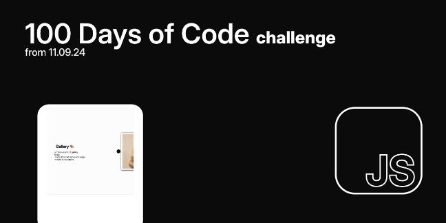

<h1 align="center">
 
</h1>
<h2>100 Days of code challenge</h2>
<h4>Some day are missing, You might ask why? </h4>
<5> Here is the answer:</5>
<ol>
 <li>Learning on mobile app. Either Mimo, Hyperskill or CodeacademyGo - all progress available on X and Threads</li>
 <li>Continuing some projects started in earlier days. For eg. React App/Website</li>
</ol>

